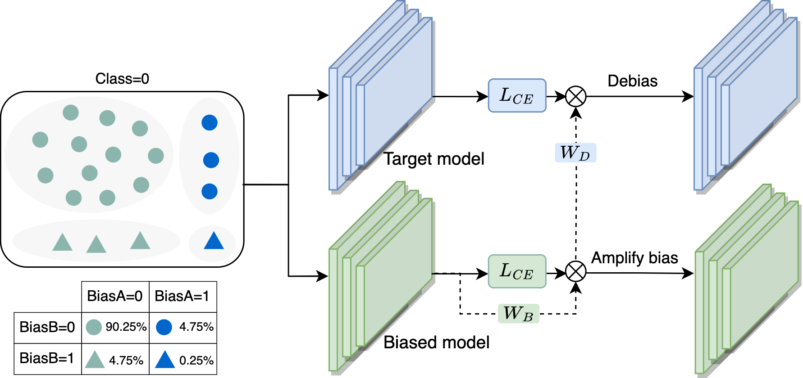

# Echoes: Unsupervised Debiasing via Pseudo-bias Labeling in an Echo Chamber


## Setup

```shell
pip install -r requirements.txt
```


## Datasets

#### CelebA
- Generate CelebA with the following script.
```shell
bash ./scripts/prepare_dataset/create_celeba.sh
```

#### UrbanCars
- Generate UrbanCars dataset with the following [repository](https://github.com/facebookresearch/Whac-A-Mole).
- Locate it under the path ./data.

#### BFFHQ
- Download BFFHQ from this [link](https://drive.google.com/drive/folders/1q_8zIqJHVSxjU2p5zaN1l2Zf-uSmS6Fx) and locate it under the path ./data.
- Unzip the BFFHQ.zip


## Training with Echoes

- You can train the model of Echoes using the following commands.
- [Optional] Turn on --wandb to use wandb for logging.
  - Please complete entity information before using [WandB](https://wandb.ai/), otherwise you will get an error.

#### CelebA
```shell
# Smiling
python trainers/lancher.py --dataset=celeba --target_id=31 --method=echoes --t_error=0.5 --alpha=0.5 --seed=1 --amp
# Narrow Eyes
python trainers/lancher.py --dataset=celeba --target_id=23 --method=echoes --t_error=0.5 --alpha=0.5 --seed=1 --amp
# Arched Eyebrows
python trainers/lancher.py --dataset=celeba --target_id=1 --method=echoes --t_error=0.5 --alpha=0.5 --seed=1 --amp
```
#### UrbanCars
```shell
python trainers/lancher.py --dataset=urbancars --method=echoes --t_error=0.3 --alpha=0.5 --seed=1 --amp
```
#### BFFHQ
```shell
# 0.5 pct
python single_bias_trainers/lancher.py --dataset=bffhq_0.5pct --method=echoes --t_error=0.5 --alpha=0.5 --seed=1 --amp
# 1.0 pct
python single_bias_trainers/lancher.py --dataset=bffhq_1pct --method=echoes --t_error=0.5 --alpha=0.5 --seed=1 --amp
# 2.0 pct
python single_bias_trainers/lancher.py --dataset=bffhq_2pct --method=echoes --t_error=0.5 --alpha=0.5 --seed=1 --amp
```

## Acknowledgments
- https://github.com/kakaoenterprise/BiasEnsemble
- https://github.com/facebookresearch/Whac-A-Mole